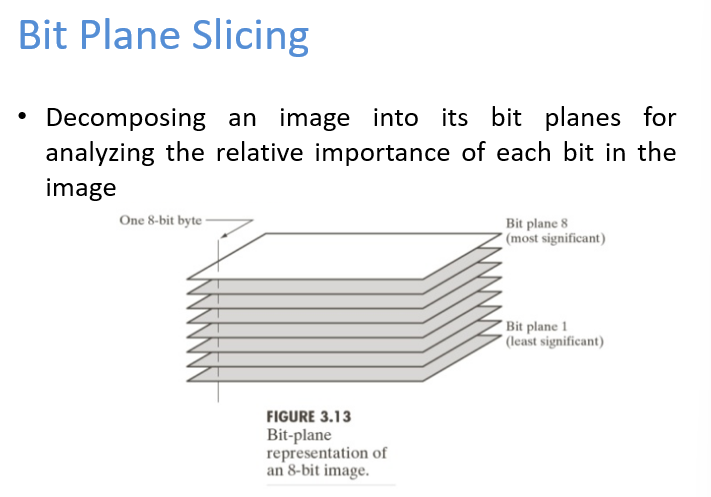

# Digital Image Processing


This source introduces **wavelets**, a powerful mathematical tool that can be thought of as a **"supercharged Fourier transform"** for analyzing signals and data. Unlike the Fourier transform, which analyzes frequency content across an entire signal, wavelets provide **multi-resolution analysis**, offering both **time and frequency information** at different scales. The core concept involves a **"mother wavelet"** that can be scaled and shifted to create an orthogonal basis for decomposing signals, enabling efficient representation and **compression of data** like images and audio. The text highlights how wavelets address limitations of traditional time-series and Fourier transforms by offering a more **tailored approach to resolution**, particularly useful for signals where low frequencies change slowly and high frequencies change quickly, and introduces several types of wavelets, such as the Haar and Daubechies wavelets.

The Fourier transform is a method used to decompose a signal, such as time series data, into a sum of sines and cosines, revealing its frequency content. These sines and cosines form an orthogonal basis for the space of functions being represented.

Key characteristics and comparisons:
*   **Purpose** It allows you to understand the frequency components present in a signal.
*   **Basis Functions** The Fourier transform uses sines and cosines as its orthogonal basis.
*   **Time-Frequency Resolution** When you apply a Fourier transform, you gain precise information about the frequency content of a signal but lose all information about when those frequencies occurred in time. This means it provides very high resolution in frequencies but a lot of uncertainty regarding the temporal localization of those frequencies.
*   **Motivation for Spectrograms** This trade-off between time and frequency resolution in the Fourier transform motivated the development of the spectrogram, which aims to provide some information about both time and frequency.
*   **Relation to Wavelets** Wavelets can be considered a "supercharged Fourier transform". The wavelet decomposition shares the same underlying idea as the Fourier decomposition: projecting a signal onto an orthogonal basis. However, wavelets generalize this concept by building hierarchical orthogonal functions, offering enhanced signal compression compared to a standard Fourier transform or spectrogram.
*   **Applications** Historically, the Fourier transform was used for image compression in older technologies like JPEG.


# Image Processing Applications


etc

# Digital Image Fundamentals


## Image Types
1. Binary Image
2. Gray Scale Image
3. Color Image 
4. Volume Image
5. MultiSpectral Images

# Digital Image Fundamentals 


## Image Formation Model


M and N for dimensions of the image
k is the intensity level, suppose if k = 8 then it means 8 bits are required to represent that intensity value 
The following table is the expansion for some examples 


The concept of **adjacency** in digital images is crucial for understanding how pixels relate to one another. It plays a fundamental role in various image processing tasks, such as edge detection, segmentation, and morphological operations. Let’s break it down step by step:

---

### 1. **What is Pixel Adjacency?**
In a digital image represented as a matrix, each pixel has neighboring pixels around it. The notion of adjacency defines which pixels are considered "neighbors" of a given pixel. This is important because many image processing algorithms rely on the relationships between adjacent pixels.

---

### 2. **Types of Adjacency**
There are two primary ways to define adjacency in a 2D grid (image):

#### **(a) 4-Neighborhood (4-Adjacency):**
This type of adjacency considers only the pixels that are directly above, below, to the left, or to the right of a given pixel. These are called the **cardinal neighbors**.

For a pixel at position $(i, j)$:
- The 4-neighbors are:
  - Top: $(i-1, j)$
  - Bottom: $(i+1, j)$
  - Left: $(i, j-1)$
  - Right: $(i, j+1)$

#### **(b) 8-Neighborhood (8-Adjacency):**
This type of adjacency includes not only the cardinal neighbors but also the diagonal neighbors. These are called the **diagonal neighbors**.

For a pixel at position $(i, j)$:
- The 8-neighbors are:
  - Top: $(i-1, j)$
  - Bottom: $(i+1, j)$
  - Left: $(i, j-1)$
  - Right: $(i, j+1)$
  - Top-left: $(i-1, j-1)$
  - Top-right: $(i-1, j+1)$
  - Bottom-left: $(i+1, j-1)$
  - Bottom-right: $(i+1, j+1)$

---

### 3. **Why Are These Definitions Important?**
The choice of adjacency (4-neighborhood or 8-neighborhood) can significantly impact the results of image processing algorithms. Here are some reasons why:

#### **(a) Connectivity:**
- In image segmentation or connected component analysis, the definition of adjacency determines how pixels are grouped together.
  - Using 4-adjacency might result in fewer connected components compared to 8-adjacency because diagonal connections are not considered.
  - For example, in a binary image, two white pixels separated diagonally would be considered part of the same component under 8-adjacency but not under 4-adjacency.

#### **(b) Edge Detection:**
- When detecting edges or boundaries in an image, the choice of adjacency affects how edges are traced.
  - If you use 4-adjacency, edges will follow only horizontal and vertical paths.
  - With 8-adjacency, edges can follow diagonal paths as well.

#### **(c) Morphological Operations:**
- Morphological operations like dilation, erosion, opening, and closing depend on the structuring element, which is often defined based on adjacency.
  - A 3x3 square structuring element corresponds to 8-adjacency, while a cross-shaped structuring element corresponds to 4-adjacency.

#### **(d) Pathfinding and Distance Metrics:**
- In pathfinding algorithms or distance calculations (e.g., finding the shortest path between two pixels), the choice of adjacency affects the possible paths and distances.
  - With 4-adjacency, movement is restricted to horizontal and vertical directions (Manhattan distance).
  - With 8-adjacency, diagonal movements are allowed, leading to shorter paths (Chebyshev distance).

---

### 4. **Visual Representation**

Here’s a visual representation of adjacency for a pixel at position $(i, j)$:

#### **4-Neighborhood:**
```
    .   .   .
    . [i,j] .
    .   .   .
```
- Neighbors: Top, Bottom, Left, Right.

#### **8-Neighborhood:**
```
    .   .   .
    . [i,j] .
    .   .   .
```
- Neighbors: Top, Bottom, Left, Right, Top-left, Top-right, Bottom-left, Bottom-right.

---

### 5. **Applications**
- **Image Segmentation**: Identifying regions of similar pixels.
- **Edge Detection**: Finding boundaries between different regions.
- **Pathfinding**: Finding the shortest path between two points in an image.
- **Morphological Filtering**: Removing noise or enhancing features in an image.

---

### 6. **Summary**
The adjacency of pixels is a fundamental concept in digital image processing. It defines how pixels are related to one another and influences various algorithms. The two main types of adjacency are:
- **4-Neighborhood**: Considers only direct horizontal and vertical neighbors.
- **8-Neighborhood**: Includes diagonal neighbors as well.

The choice between these depends on the specific application and desired behavior of the algorithm.

---

### Final Answer:
$$
\boxed{\text{Pixel adjacency defines the relationship between pixels in a digital image, with 4-adjacency considering only horizontal and vertical neighbors, and 8-adjacency including diagonal neighbors as well.}}
$$

The image you provided explains the concept of **adjacency** in digital images, specifically focusing on **4-adjacency** and **8-adjacency**, along with how gray-level values influence adjacency. Let’s break it down step by step:

---

### 1. **Key Definitions from the Image**
#### (a) **Set of Gray-Level Values (\( V \))**
   - \( V \): The set of gray-level values used to define adjacency.
   - In the examples provided:
     - For the left image: \( V = \{0, 1\} \)
     - For the right image: \( V = \{1, 2\} \)

   This means that only pixels with values in the set \( V \) are considered when determining adjacency.

#### (b) **4-Adjacency**
   - Two pixels \( p \) and \( q \) are **4-adjacent** if:
     - \( q \) is in the set \( N_4(p) \), which represents the 4-neighbors of \( p \).
     - The 4-neighbors are the pixels directly above, below, to the left, or to the right of \( p \).

#### (c) **8-Adjacency**
   - Two pixels \( p \) and \( q \) are **8-adjacent** if:
     - \( q \) is in the set \( N_8(p) \), which represents the 8-neighbors of \( p \).
     - The 8-neighbors include the 4-neighbors plus the diagonal neighbors (top-left, top-right, bottom-left, bottom-right).

---

### 2. **Examples in the Image**

#### (a) **Left Example: \( V = \{0, 1\} \)**

The matrix is:
\[
\begin{bmatrix}
0 & 1 & 0 \\
0 & 1 & 0 \\
0 & 0 & 0
\end{bmatrix}
\]

Here, the gray-level values are restricted to \( V = \{0, 1\} \). Only pixels with values 0 or 1 are considered for adjacency.

- **Focus on the central pixel \( p \) at position (2, 2) with value 1:**
  - **4-Neighbors (\( N_4(p) \)):**
    - Top: (1, 2) with value 1
    - Bottom: (3, 2) with value 0
    - Left: (2, 1) with value 0
    - Right: (2, 3) with value 0
    - Among these, only the top neighbor (1, 2) has a value in \( V = \{0, 1\} \), so it is 4-adjacent to \( p \).

  - **8-Neighbors (\( N_8(p) \)):**
    - Top: (1, 2) with value 1
    - Bottom: (3, 2) with value 0
    - Left: (2, 1) with value 0
    - Right: (2, 3) with value 0
    - Top-left: (1, 1) with value 0
    - Top-right: (1, 3) with value 0
    - Bottom-left: (3, 1) with value 0
    - Bottom-right: (3, 3) with value 0
    - Among these, only the top neighbor (1, 2) has a value in \( V = \{0, 1\} \), so it is 8-adjacent to \( p \).

#### (b) **Right Example: \( V = \{1, 2\} \)**

The matrix is:
\[
\begin{bmatrix}
0 & 1 & 1 \\
0 & 2 & 0 \\
0 & 0 & 1
\end{bmatrix}
\]

Here, the gray-level values are restricted to \( V = \{1, 2\} \). Only pixels with values 1 or 2 are considered for adjacency.

- **Focus on the central pixel \( p \) at position (2, 2) with value 2:**
  - **4-Neighbors (\( N_4(p) \)):**
    - Top: (1, 2) with value 1
    - Bottom: (3, 2) with value 0
    - Left: (2, 1) with value 0
    - Right: (2, 3) with value 0
    - Among these, only the top neighbor (1, 2) has a value in \( V = \{1, 2\} \), so it is 4-adjacent to \( p \).

  - **8-Neighbors (\( N_8(p) \)):**
    - Top: (1, 2) with value 1
    - Bottom: (3, 2) with value 0
    - Left: (2, 1) with value 0
    - Right: (2, 3) with value 0
    - Top-left: (1, 1) with value 0
    - Top-right: (1, 3) with value 1
    - Bottom-left: (3, 1) with value 0
    - Bottom-right: (3, 3) with value 1
    - Among these, the top neighbor (1, 2) and the top-right neighbor (1, 3) have values in \( V = \{1, 2\} \), so they are 8-adjacent to \( p \).

---

### 3. **Key Observations**
- **Gray-Level Values (\( V \))**: Only pixels with values in the set \( V \) are considered for adjacency. This means that pixels with values outside \( V \) (e.g., 0 in the right example) are ignored when determining adjacency.
- **4-Adjacency vs. 8-Adjacency**:
  - 4-Adjacency considers only horizontal and vertical neighbors.
  - 8-Adjacency includes diagonal neighbors as well.
- **Impact of \( V \)**: The choice of \( V \) can significantly affect which pixels are considered adjacent. For example, in the right image, if \( V = \{1, 2\} \), then only pixels with values 1 or 2 are considered, ignoring all other values (e.g., 0).

---

### 4. **Summary**
The image illustrates how adjacency is defined based on:
1. The set of gray-level values (\( V \)).
2. Whether 4-adjacency or 8-adjacency is used.
3. The specific values of neighboring pixels relative to \( V \).

In both examples:
- **4-Adjacency** restricts adjacency to direct horizontal and vertical neighbors.
- **8-Adjacency** expands adjacency to include diagonal neighbors as well.
- Only pixels with values in \( V \) are considered for adjacency.

---

### Final Answer:
$$
\boxed{\text{Adjacency depends on the set of gray-level values } V \text{ and whether 4-adjacency or 8-adjacency is used. Only pixels with values in } V \text{ are considered adjacent.}}
$$


City block distance, also known as Manhattan distance or taxicab distance, is a way to measure distance between two points by summing the absolute differences of their coordinates. It is called city block distance because it represents the distance a vehicle would travel on a grid-like street network, like in Manhattan, where it can only travel along the streets (either horizontally or vertically). 
Formula:
Given two points (x1, y1) and (x2, y2), the city block distance is calculated as: 
Code

|x1 - x2| + |y1 - y2|

Example:
If point A is at (2, 3) and point B is at (5, 7), the city block distance between them is:
Code

|2 - 5| + |3 - 7| = |-3| + |-4| = 3 + 4 = 7

Key Characteristics:

    Grid-based:
    It is suitable for measuring distances in grid-like structures like city streets or pixel grids in image processing.
    Not the shortest path:
    Unlike Euclidean distance (straight line), city block distance follows the grid lines, potentially taking a longer path.
    Sum of absolute differences:
    It is the sum of the absolute differences in coordinates, not the square root of the sum of squared differences (as in Euclidean distance).
    Used in various applications:
    City block distance is applied in image processing, computer vision, and other fields where movement along grid lines is relevant. 

    City Block Distance
    The name City block distance (also referred to as Manhattan distance) is explained if you consider two points in the xy-plane. ...

In image processing, the chessboard distance (or Chebyshev distance) between two pixels is the minimum number of moves a king would need to travel from one pixel to the other on an otherwise empty chessboard. It's calculated as the maximum of the absolute differences of their coordinates. This distance metric is useful in scenarios where diagonal movement is allowed, such as in certain image segmentation or connectivity algorithms.


This image demonstrates **path connectivity in a digital image**, a core concept in **mathematical morphology** and **image analysis**. Let's break it down:

---

### **Terminology:**

* **V = {2, 3, 5}**: The set of valid (or foreground) pixel values for path traversal.
* **p and q**: Two pixels (black pixels in the top image) that we are trying to connect using a path.
* **4-path, 8-path, m-path**: Different types of neighborhood-based connectivity.

---

### **Top Grid (Main Image):**

* It shows a 6x6 grid of grayscale values.
* Pixels `p` and `q` are marked in black.
* The task: **Is there a valid path from p to q using only pixels in V = {2, 3, 5}?**

---

### **Connectivity Models (Bottom Three Grids):**

#### **1. 4-path:**

* Uses **4-neighbor connectivity**: Up, Down, Left, Right.
* Diagonal steps are not allowed.
* Arrows show a step-by-step path from `p` to `q`, moving through values only in V = {2, 3, 5}.

#### **2. 8-path:**

* Uses **8-neighbor connectivity**: Up, Down, Left, Right + Diagonals.
* More flexible pathfinding than 4-path.
* The path includes diagonal movement.

#### **3. m-path (mixed path):**

* A hybrid of 4-path and 8-path that **avoids ambiguity in connected components**.
* m-paths allow diagonal movement only **if** the two corresponding 4-neighbors are not both in V.
* Helps avoid false connections in morphological processing.


# Intensity Transformation and Spatial Filtering





# Histogram Processing


